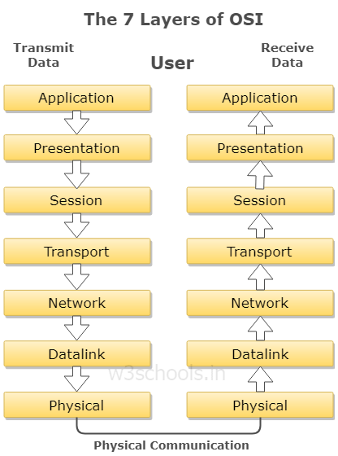

<!-- OSI all layers
TCP/IP all layers and its functions, protocols in all layers
TCP/IP vs OSI
HTTP vs HTTPS
subnetting
networking topologies, when where
types of networks
DNS
MAC address
IPV4 IPV6
what is protocol
port numbers of important protocol

Routers, switch, hub, servers, workstations
proxy servers
firewalls -->

# OSI Model

  

* OSI is layered model for consist of 7 layers
* It describes how data is send from one computer to other
* each layer has diffrant function
* while sending each layer get data from upper layer and give data to lower layer
* while sending each layer get data from lower layer and give data to upper layer
* OSI is only refrance model and not practically used.
* 7 Layers of OSI Model
  * Application
  * Session
  * Presentation
  * Transport
  * Network
  * Data Link
  * Physical

  

# Physical Layer

* Lowest Layer in hierachy
* deal with physical transmition of data bits .
* while sending it converts 0 & 1 into electrical signal
* while reciving converts electrical signal into 0, 1.

## Functions

### Bit Syncronization: 
provide clock timing. Determining the boundary (start and end) of signal bit i.e. time window for a bit.
  
  
### Bit Rate control
if sender is fast and reciver is slow physical layer manges the data tranmition rate i.e. bit transmission per second. 
  

### Topology
physical layer defines way of diffrant devices arranged in netwok
  

### Transmition modes 
it defines mode of data flow between two connected device

    Simplex: one way communication. only one sender can send and other only recive ie. Brodcasting, eg FM radio

    Half duplex: both user can send but at a time one sends and other recives two user cannot send data at a time. e.g Walkie-talkie 

    Full duplex: both can send and recive at a time. e.g phone call

[Simplex, Half duplex & full Duplex](https://www.geeksforgeeks.org/difference-between-simplex-half-duplex-and-full-duplex-transmission-modes/)

___Devices works on physical layer:  Hub, Repeater, Modem, Cables___

  

# Data Link Layer

* Responsible for node to node delivery of data.
* It is responsible for error-free data transmission 
* Transmit data using mac address
* receive packet from Network layer 
* packet further divided into frames depending on the frame size of NIC(Network Interface Card)
* The Receiver’s MAC address is obtained by placing an ARP(Address Resolution Protocol) request and destination host will reply with its MAC address
  
* Two sublayers
    * Logical Link control
    * Media acsess control 

## Functions of Data Link Layer

### Framing
Its convert data packet into data frame and add meaningfull header to ensure transmission of data to meaningfull reciever

### Physical Addressing 
Adds physical address of sender and reciever to the headder of each frame

### Error Control
Error Correction Detection algo used to control Error. and retransmit damaged packet

[Error Control Protocols](https://www.tutorialspoint.com/error-control-in-data-link-layer/)

### Flow Control
Data transmission rate must be constant on both side else data get corrupted
flow control manage the amount of data can send before reciving acknoledgement

[Flow Control Protocols](https://www.tutorialspoint.com/flow-control-in-data-link-layer/)

### Access control: 
When a single communication channel is shared by multiple devices, MAC sub-layer of data link layer helps to determine which device has control over the channel at a given time

[Access Control Protocols](https://www.geeksforgeeks.org/multiple-access-protocols-in-computer-network/)

___Devices works on physical layer:  Switch & Bridge___

# Network Layer

Bakicha udya
