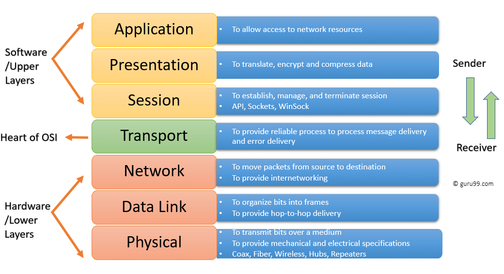
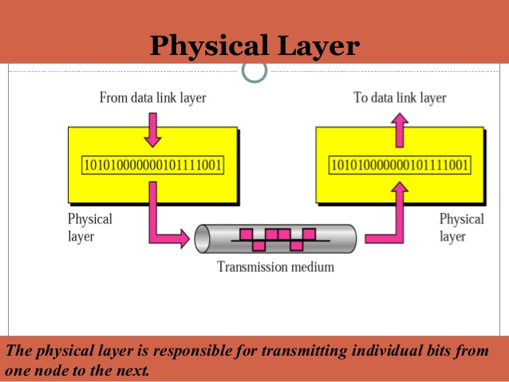
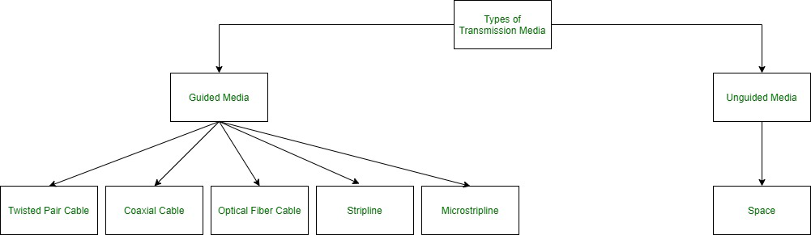
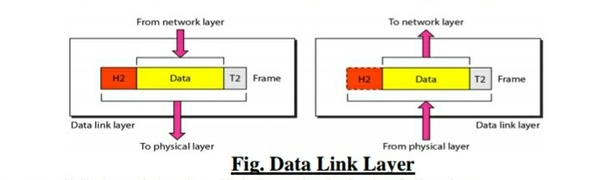
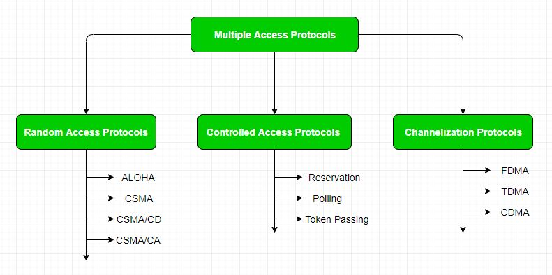
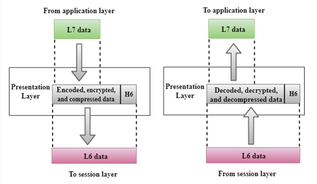
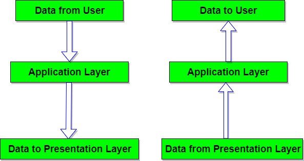

<!-- 
OSI all layers
TCP/IP all layers and its functions, protocols in all layers
TCP/IP vs OSI
HTTP vs HTTPS
subnetting
networking topologies, when where
types of networks
DNS
MAC address
IPV4 IPV6
what is protocol
port numbers of important protocol

Routers, switch, hub, servers, workstations
proxy servers
firewalls -->

# OSI Model

  

* OSI is layered model for consist of 7 layers
* It describes how data is send from one computer to other
* each layer has diffrant function
* while sending each layer get data from upper layer and give data to lower layer
* while sending each layer get data from lower layer and give data to upper layer
* OSI is only refrance model and not practically used.
* 7 Layers of OSI Model
  * Application
  * Session
  * Presentation
  * Transport
  * Network
  * Data Link
  * Physical

  

# Physical Layer

* Lowest Layer in hierachy
* deal with physical transmition of data bits .
* while sending it converts 0 & 1 into electrical signal
* while reciving converts electrical signal into 0, 1.

## Functions

### Bit Syncronization: 
provide clock timing. Determining the boundary (start and end) of signal bit i.e. time window for a bit.
  
  
### Bit Rate control
if sender is fast and reciver is slow physical layer manges the data tranmition rate i.e. bit transmission per second. 
  

### Topology
physical layer defines way of diffrant devices arranged in netwok
  

### Transmition modes 
it defines mode of data flow between two connected device

    Simplex: one way communication. only one sender can send and other only recive ie. Brodcasting, eg FM radio

    Half duplex: both user can send but at a time one sends and other recives two user cannot send data at a time. e.g Walkie-talkie 

    Full duplex: both can send and recive at a time. e.g phone call

[Simplex, Half duplex & full Duplex](https://www.geeksforgeeks.org/difference-between-simplex-half-duplex-and-full-duplex-transmission-modes/)

[Transnmission media](https://www.geeksforgeeks.org/types-transmission-media/)

___Devices works on physical layer:  Hub, Repeater, Modem, Cables___

  

# Data Link Layer

* Responsible for node to node delivery of data.
* It is responsible for error-free data transmission 
* Transmit data using mac address
* receive packet from Network layer 
* packet further divided into frames depending on the frame size of NIC(Network Interface Card)
* The Receiver’s MAC address is obtained by placing an ARP(Address Resolution Protocol) request and destination host will reply with its MAC address
  
* Two sublayers
    * Logical Link control
    * Media acsess control 

## Functions of Data Link Layer

### Framing
Its convert data packet into data frame and add meaningfull header to ensure transmission of data to meaningfull reciever

### Physical Addressing 
Adds physical address of sender and reciever to the headder of each frame

### Error Control
bits added at end to detect error. Diffrent Error Correction & Detection algo used to control Error. and retransmit damaged packet

[Error corrections & Detection: see only parity checking, CRC, LRC & Hamming code](https://www.electronicshub.org/error-correction-and-detection-codes)

[Error Control Protocols- stop & wait Arq, Go back N ARQ, & Selective Repeat ARQ](https://www.tutorialspoint.com/error-control-in-data-link-layer)

### Flow Control
Data transmission rate must be constant on both side else data get corrupted
flow control manage the amount of data can send before reciving acknoledgement

[Flow Control Protocols: Stop & wait, Sliding Window](https://www.tutorialspoint.com/flow-control-in-data-link-layer)

### Access control: 
When a single communication channel is shared by multiple devices, MAC sub-layer of data link layer helps to determine which device has control over the channel at a given time

[Access Control Protocols: see in beolow image](https://www.geeksforgeeks.org/multiple-access-protocols-in-computer-network)

___Devices works on physical layer:  Switch & Bridge___

# Network Layer

* Network layer works transmission of data from one host to another which located in diffrent network.
* Chooses shortest path from available paths for transmission
* It adds sender's & reciever's IP address in the header of packet

## Functions of network Layers

### Routing
Determine the which route(shortest route) should be taken from source to destination. 

[Routing Algo](https://www.tutorialspoint.com/what-is-a-routing-algorithm-in-computer-network) 

[DVR, RIP, IGP, EGP, OSPF, EIGRP](https://www.guru99.com/routing-protocol-types.html)

### Logical Addressing
To uniquely identify each device network layer use logical addressing i.e IP address. The sender & receiver’s IP address are placed in the header of packet

### Internetworking: 
This is the main role of the network layer that it provides the logical connection between different types of networks.

### Fragmentation: 
The fragmentation is a process of breaking the packets into the smallest individual data units that travel through different networks.

### Forwording
Forwarding is simply defined as the action applied by each router when a packet arrives at one of its interfaces. When a router receives a packet from one of its attached networks, it needs to forward the packet to another attached network (unicast routing) or to some attached networks

## Services By Network Layer

### Guaranteed delivery: 
guarantees that the packet will arrive at its destination.

### Guaranteed delivery with bounded delay:
packet will be delivered within a specified host-to-host delay bound.

### In-Order packets: 
ensures that the packet arrives at the destination in the order in which they are sent.

### Guaranteed max jitter: 
ensures that the amount of time taken between two successive transmissions at the sender is equal to the time between their receipt at the destination.

### Security services: 
The network layer provides security by using a session key between the source and destination host. The network layer in the source host encrypts the payloads of datagrams being sent to the destination host. The network layer in the destination host would then decrypt the payload. In such a way, the network layer maintains the data integrity and source authentication services.

___Device works on Network Layer: Router___

# Transport Layer

* Heart of OSI 
* Data in transport layer referred as Segment.
* Responsible for end to end (process to process )delevery of complete message
* at sender side take formated data from upper layer and perform Segmentation
* Adds Port no to to header & forword to network layer
* implement flow and error control to ensure proper data transmission.
* At receiver’s side Transport Layer reads the port number from its header and forwards the Data which it has received to the respective application. It also performs sequencing and reassembling of the segmented data.
* Transport layer is operated by the Operating System. It is a part of the OS and communicates with the Application Layer by making system calls
  
## Functions of Transport Layer

### Segmentation & Reassembly:
Take Message from session Layer and breaks into segment. add header to segments. and at reciver side reassemble theese segments.

### Service Point Addressing:
To delever message to correct process transport layer adds port no(Or Service Point Address) to header

### Connection Control: 
It includes 2 types:

Connectionless Transport Layer : Each segment is considered as an independent packet and delivered to the transport layer at the destination machine.

Connection Oriented Transport Layer : Before delivering packets, connection is made with transport layer at the destination machine.

### Flow Control: 
In this layer, flow control is performed end to end.

### Error Control: 
Error Control is performed end to end in this layer to ensure that the complete message arrives at the receiving transport layer without any error. Error Correction is done through retransmission

## Services by Transport Layer:
 
### Connection Oriented Service: 
It is a three-phase process which include
– Connection Establishment
– Data Transfer
– Termination / disconnection
In this type of transmission, the receiving device sends an acknowledgement, back to the source after a packet or group of packet is received. This type of transmission is reliable and secure.

### Connection less service: 
It is a one-phase process and includes Data Transfer. In this type of transmission, the receiver does not acknowledge receipt of a packet. This approach allows for much faster communication between devices. Connection-oriented service is more reliable than connectionless Service.

## What is Port Numer:
* Port number is the part of the addressing information used to identify the senders and receivers of messages in computer networking.  
* server identify the process by port no and send message to that process
* diffrant protocol has diffrant set of port no's

* Ports are represented by 16-bit numbers. 
* 0 to 1023 are restricted port numbers are as they are used by well-known protocol services. 
* 1024 to 49151 are registered port numbers means it can be registered to specific protocols by software corporations 
*  49152 to 65536 are used as private ports means they can be used by anybody.

[Why Error & flow control done at Trnsport layer while it is already in done DLL](https://gateoverflow.in/170085/error-control-layers-computer-networks-transport-layer-layers)

[What is Socket](https://www.tutorialspoint.com/unix_sockets/what_is_socket.htm)

[TCP & UDP](https://www.javatpoint.com/computer-network-transport-layer-protocols)

# Session Layer

* Responsible for establishing connection, maintain sessions & Authentication
* Mintain Security

## Functions of Session Layer

### Establishment maintanance & Termination of Session

Allows two process to make use & terminate connection between them

### Syncronization 

This Layer allow to add checkpoints. this checkpoints allow to identify errors. so that data resyncronize properly and avoid data loss

### Dialog Controller
The session layer allows two systems to start communication with each other in half-duplex or full-duplex

### Token management. 
Through this, it prevents the two users to simultaneously attempt the same critical operation

# Presantation Layer 

* Also called Translation layer
* It extract data from application layer and manipulate as required 

## Functions of Presantation Layer

### Translation
Translate data froam one format to anather like ASCII to EBCIDIC

### Encryption/Decryption
Plain text encrypted using key value in senders side. & decrypted at recivers side

### Compression
Reduce No of of data bits

# Application Layer

* This layer implemented by Application 
* Theese application produce data that to transmit over network
* This layer used to display recived information
* The Appications are Like browsers or any other application that transmit data.

## Functions of the Application layer
* Network Virtual Terminal
* FTAM-File transfer access and management
* Mail Services
* Directory Services

# TCP/IP Model
* Consist of 4 Layers
  *  Application layer
  *  Transport Layer
  *  Internet Layer
  *  Network accsess link layer
  
# Network Access layer
* Combination of physical & Data link layer of OSI model
* it send data using hardware addressing (mac)
* diffrant Protocols used to transmission of data
* Data is called a frame. It contains the IP packet(from upper layer) as well as a protocol header and trailer from this layer
* This header and trailer are only relevant in the physical network. When a router receives a frame, it strips of the header and trailer and adds a new header and trailer.

# Internet Layer

* It is works like network layer of osi model
* This layer has protocol for logical transmission of data

## Protocols in Internet Layer

### IP – 
It is responsible for delivering packets from the source host to the destination host by looking at the IP addresses in the packet headers.

## ICMP – 
stands for Internet Control Message Protocol. It is encapsulated within IP datagrams and is responsible for providing hosts with information about network problems.

### ARP – 
stands for Address Resolution Protocol. Its job is to find the hardware address of a host from a known IP address. ARP has several types: Reverse ARP, Proxy ARP, Gratuitous ARP and Inverse ARP

# Transport Layer/ Host To Host Layer
* works as transport layer of osi model
* responsible for end to end communication and error free delevery of data
  
## Protocols in Transport layer

### Transmission Control Protocol
TCP is connection oriented protocolProvide reliable and error free transmission

perform sequencing and segmentation: dividing data(from application layer) into segment give them a sequence no at senders side & reassemble accoring to theire sequence no in recivers side.

sends acknoledgement on on data recived & control the flow of data

### UDP protocol
connectionless protocol & it does not not provide services like TCP
 It is the go-to protocol if your application does not require reliable transport as it is very cost-effective.

# Application Layer

* Performs the functions of top three layers of the OSI model: Application, Presentation and Session Layer
* responsible for no to node communication
  
[Protocols in Application Layer](https://gradeup.co/application-layer-protocols-dns-smtp-pop-ftp-http-i-ba1194bd-c5ab-11e5-9dcb-5849de73f8e1)
